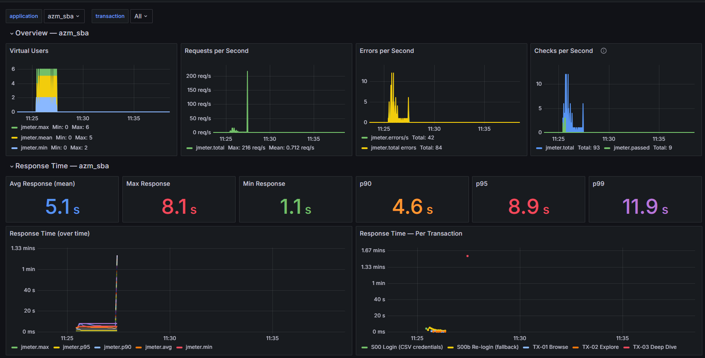
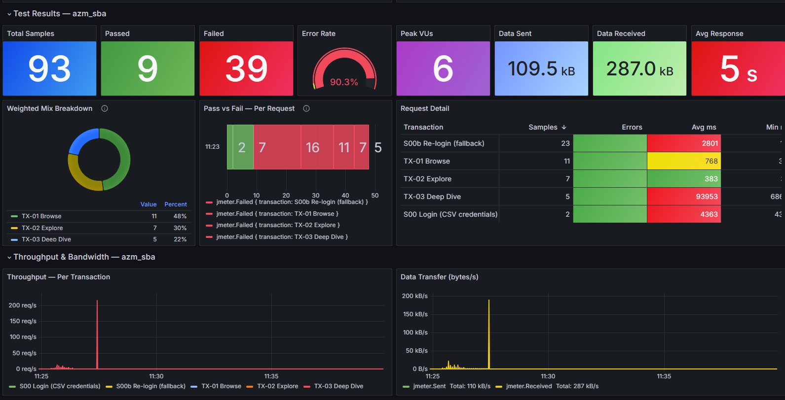
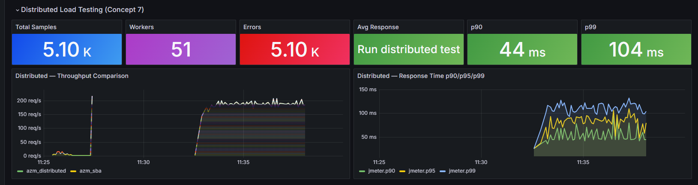

# AZM QA — JMeter Performance Testing (Milestone 3)

**Engineer:** Zain Hashmi  
**Tool:** Apache JMeter 5.6.3  
**Target:** SBA Academy sandbox (Open edX — sitech-cloud)  
**Script:** [`tests/azm_sba_perf.jmx`](tests/azm_sba_perf.jmx) — single file, all 17 concepts

---

## Quick Start

```powershell
# Prerequisites: JMeter 5.6.3 on PATH, Java 17+, Python 3, Docker

# 1. Start monitoring stack
cd monitoring; docker compose up -d; cd ..

# 2. Run tests
.\run\smoke.ps1       # 1 VU    — validates setup
.\run\baseline.ps1    # 30 VUs  — 10 min
.\run\peak.ps1        # 40 VUs  — 15 min
.\run\spike.ps1       # 50 VUs  — 15 min

# 3. Proof runs
.\run\proof-self-heal.ps1    # Self-healing evidence
.\run\proof-jdbc.ps1         # DB validation evidence

# 4. Validation
python scripts\validate_repo.py
python ci\secret_scan.py
python scripts\check_mock_parity.py   # mock answers every path the plan calls
```

Execution evidence from the local mock (chaining, retry, self-healing, per-label
percentiles) is committed under [`docs/evidence/`](docs/evidence/EVIDENCE.md).

Results go to `results/<level>-<timestamp>/` with `.jtl`, HTML report, and SLA verdict.

---

## Project Structure

```
├── tests/
│   └── azm_sba_perf.jmx                  # Single JMX — all 17 concepts
├── config/
│   ├── user.properties                    # 49 externalized properties (base_url, threads, rampup, etc.)
│   ├── staging.properties                 # Staging environment overlay
│   ├── local.properties                   # Local dev overlay
│   ├── rmi-nossl.properties               # RMI config for distributed testing
│   └── endpoints.md                       # API endpoint mapping
├── data/
│   └── logins.csv                         # 120 synthetic test accounts
├── scripts/
│   ├── groovy/                            # 12 Groovy scripts (all cacheKey=true)
│   │   ├── self_heal_token.groovy         # 4-layer self-healing agent
│   │   ├── correlation_guardian.groovy    # Multi-field correlation healer
│   │   ├── self_heal_stats.groovy         # Healing statistics reporter
│   │   ├── signature_preprocessor.groovy  # HMAC-SHA256 request signing
│   │   ├── retry_postprocessor.groovy     # Retry logic with backoff
│   │   ├── retry_reset_preprocessor.groovy# Retry state reset
│   │   ├── jdbc_assertion.groovy          # DB row validation
│   │   ├── jdbc_seed_h2.groovy            # H2 embedded DB setup for CI
│   │   ├── token_pool_publish.groovy      # Inter-thread token sharing
│   │   ├── token_pool_bind.groovy         # Token binding per thread
│   │   ├── server_metrics.groovy          # Server-side metric collection
│   │   └── teardown_cleanup.groovy        # Post-run cleanup
│   ├── validate_repo.py                   # 15-check static validator
│   ├── check_sla.py                       # SLA checker with bottleneck ID
│   ├── compare_runs.py                    # Run-over-run regression detector
│   └── partition_csv.py                   # CSV splitter for distributed workers
├── ci/
│   ├── secret_scan.py                     # Credential leak prevention
│   ├── sla_gate.py                        # CI SLA gate with JSON output
│   └── generate_summary.py               # GitHub Step Summary generator
├── .github/workflows/
│   ├── perf.yml                           # Full pipeline: validate → test → analyze → publish
│   ├── validate.yml                       # Static validation gate
│   └── proof-tests.yml                    # Evidence collector (self-heal/JDBC/retry)
├── run/
│   ├── smoke.ps1                          # 1 VU smoke test
│   ├── baseline.ps1                       # 30 VU baseline
│   ├── peak.ps1                           # 40 VU peak load
│   ├── spike.ps1                          # 50 VU spike burst
│   ├── distributed.ps1                    # Distributed controller script
│   ├── worker-start.ps1                   # Worker node launcher
│   ├── proof-self-heal.ps1                # Self-healing evidence run
│   └── proof-jdbc.ps1                     # JDBC validation evidence run
├── monitoring/
│   ├── docker-compose.yml                 # InfluxDB 1.8 + Grafana 10.4.2
│   └── provisioning/                      # Auto-provisioned datasource + dashboard
├── mock/
│   └── mock_api.py                        # Local mock server for offline testing
├── report/
│   └── concept-mapping.md                 # Full submission report
└── docs/
    └── screenshots/                       # Grafana dashboard screenshots
```

---

## Virtualization — Docker Containers

The entire monitoring infrastructure runs as Docker containers via Docker Compose — no manual installation of InfluxDB or Grafana needed. One command brings everything up, fully configured and ready to receive data.

**File:** `monitoring/docker-compose.yml`

| Container | Image | Port | Role |
|---|---|---|---|
| `azm-influxdb` | `influxdb:1.8` | 8086 | Time-series database — stores all JMeter metrics (response times, throughput, errors, active threads) |
| `azm-grafana` | `grafana/grafana:10.4.2` | 3000 | Dashboard UI — auto-provisioned with datasource + 38-panel dashboard, no manual setup |

**Why Docker:**
- Reproducible environment — same stack on every machine, no "works on my laptop" issues
- Auto-provisioning — Grafana datasource (`provisioning/datasources/influxdb.yml`) and dashboard (`provisioning/dashboards/azm-sba-perf.json`) are volume-mounted and loaded on first boot
- Persistent volumes — `influx-data` and `grafana-data` survive container restarts, test data is retained across runs
- Clean teardown — `docker compose down -v` removes everything cleanly

```powershell
# Start containers
cd monitoring; docker compose up -d; cd ..

# Grafana: http://localhost:3000 (admin / admin)
# InfluxDB: http://localhost:8086 (database: jmeter)

# Stop and remove
cd monitoring; docker compose down; cd ..

# Full cleanup including data volumes
cd monitoring; docker compose down -v; cd ..
```

### Data Flow

```
JMeter (Backend Listener)
    │  HTTP POST every 15s (InfluxDB line protocol)
    ▼
azm-influxdb container (port 8086)
    │  database: jmeter, measurement: jmeter
    │  fields: hit, avg, min, max, pct90, pct95, pct99,
    │          countError, maxAT, meanAT, minAT,
    │          sentBytes, receivedBytes
    ▼
azm-grafana container (port 3000)
    │  InfluxQL queries, auto-refresh 5s
    ▼
38-panel dashboard (7 sections)
```

### Dashboard — 38 Panels, 7 Sections

The custom dashboard (`monitoring/provisioning/dashboards/azm-sba-perf.json`) provides real-time visibility during test execution:

| Section | Panels | What It Shows |
|---|---|---|
| **Overview** | Virtual Users · Requests/s · Errors/s · Checks/s | Live load shape — how many VUs are active, request throughput, and error rate trending over time |
| **Response Time** | Avg · Max · Min · p90 · p95 · p99 · Time Series · Per Transaction | Full latency breakdown — stat panels show current percentiles, time-series chart shows how response times change under load, per-transaction view isolates slow endpoints |
| **Test Results** | Total Samples · Passed · Failed · Error Rate · Peak VUs · Data Sent · Data Received · Avg Response | Summary counters — at a glance: how many requests ran, pass/fail ratio, error rate gauge, and data transfer volume |
| **Weighted Mix** | Mix Breakdown · Pass vs Fail per Request · Request Detail | Validates the 50/30/20 traffic split is working correctly and shows which specific requests are failing |
| **Throughput** | Per-Transaction Throughput · Data Transfer (bytes/s) | Stacked throughput chart per transaction type and network bandwidth consumption |
| **Per Transaction** | Response Time per Sampler | Isolates each HTTP sampler's response time — the chart that answers "which API call is the bottleneck?" |
| **Distributed** | Total Samples · Workers · Errors · Avg Response · p90 · p99 · Throughput Comparison · Response Time Comparison | Worker-level breakdown — proves all workers participated evenly, compares throughput and latency across nodes |

### Dashboard Screenshots

<p align="center">
  
</p>

<p align="center">
  
</p>

<p align="center">
  
</p>

---

## Distributed Load Testing

Distributed testing splits the load across multiple machines — the controller orchestrates and workers generate the actual traffic. Total load = threads × workers.

**Architecture:**

```
                    ┌─────────────────────┐
                    │     Controller      │
                    │  (this machine)     │
                    │  orchestrates only  │
                    │  NO load generation │
                    └──────┬──────┬───────┘
                      -G   │      │  -G
                  props    │      │  props
                    ┌──────▼──┐ ┌─▼───────┐
                    │ Worker 1│ │ Worker 2 │
                    │ 50 VUs  │ │ 50 VUs   │
                    │ CSV pt.1│ │ CSV pt.2 │
                    └─────────┘ └──────────┘
                         = 100 VUs total
```

**Key implementation details:**

| Feature | Why it matters |
|---|---|
| `-G` property forwarding | `-J` only sets properties on the controller JVM — workers never see them. `-G` sends properties to every remote worker. Without this, workers silently use defaults |
| CSV partitioning | Each worker opens `logins.csv` at row 1 independently. `scripts/partition_csv.py` splits the CSV so each worker gets its own slice — no duplicate logins |
| Fixed RMI ports | JMeter uses dynamic ephemeral ports by default, which breaks firewalls. `config/rmi-nossl.properties` pins both `server_port` and `server.rmi.localport` |
| NTP clock check | Merged JTL timestamps must be comparable across machines. The controller script warns if the Windows Time service isn't running |
| Controller doesn't load | The controller only aggregates results. Running it as a worker simultaneously makes it the bottleneck |
| Post-run worker analysis | After the run, per-worker sample counts and error rates are printed — proves all workers participated and load was evenly distributed |

**Scripts:**

| File | Role |
|---|---|
| `run/distributed.ps1` | Controller launcher — validates workers, forwards 30+ properties via `-G`, merges results |
| `run/worker-start.ps1` | Worker launcher — sets hostname, RMI ports, loads its CSV partition |
| `scripts/partition_csv.py` | Splits `data/logins.csv` into per-worker slices |

**Usage:**

```powershell
# 1. Partition CSV for workers
python scripts\partition_csv.py --workers 2

# 2. On each worker machine
.\run\worker-start.ps1 -WorkerIndex 1 -HostIp 10.0.0.11

# 3. On controller
.\run\distributed.ps1 -Workers 10.0.0.11,10.0.0.12 -Threads 100
# Result: 100 threads × 2 workers = 200 VUs total
```

---

## CI/CD

Three workflows, all **manual trigger only** (`workflow_dispatch`):

| Workflow | Jobs | Purpose |
|---|---|---|
| `perf.yml` | validate → test → analyze → publish | Full pipeline with SLA gate, regression detection, and GitHub Pages dashboard |
| `validate.yml` | validate | Static checks: secret scan, Groovy syntax, YAML lint |
| `proof-tests.yml` | proof | Evidence collection for self-heal, JDBC, retry — uploads artifacts |

---

## Security

- Synthetic test accounts only (`.invalid` domain) — never production credentials
- All secrets supplied at runtime via `-J` flags / GitHub Secrets — nothing committed
- `ci/secret_scan.py` scans for API keys, tokens, passwords before every pipeline
- `results/`, `*.log`, `rmi_keystore.jks` excluded via `.gitignore`
- JDBC gated behind `jdbc_enabled` property — degrades cleanly without the driver
